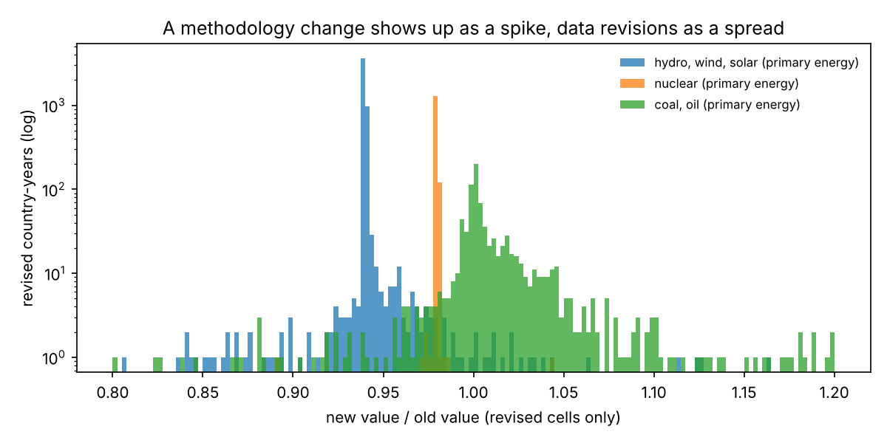
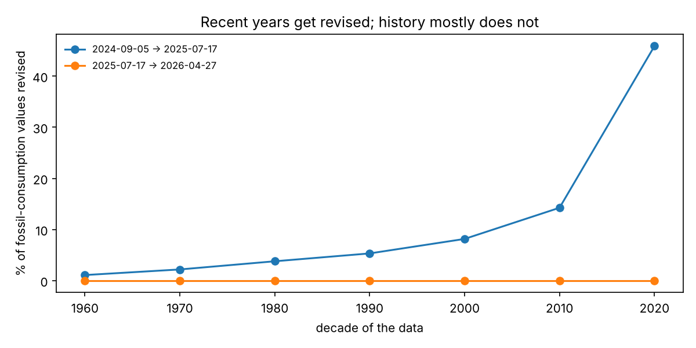
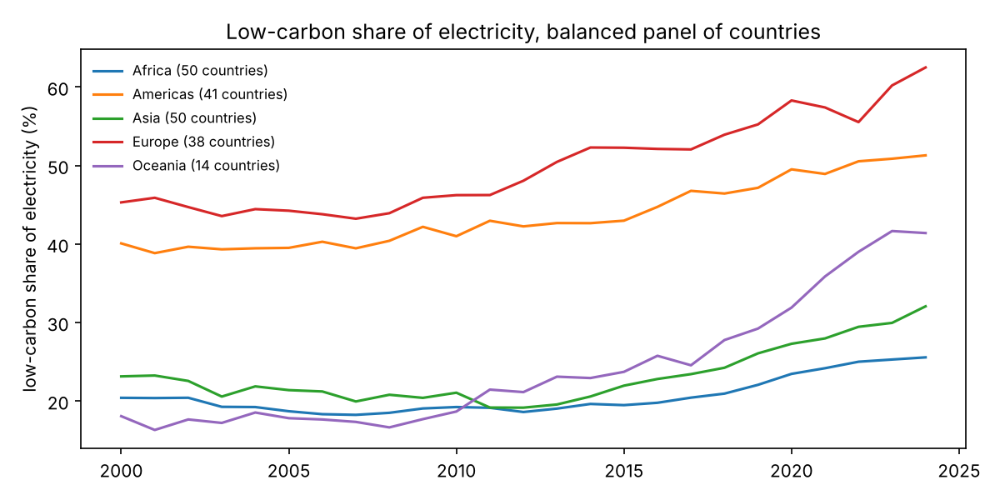

# Energy data pipeline: versioned ingestion and release-to-release change capture

[](https://github.com/kpavan27/energy-data-pipeline/actions/workflows/ci.yml)

Published statistics are not fixed. Each new release of a dataset quietly revises history, and a dashboard built on "the latest file" can't tell a real trend from a changed method. This pipeline ingests three pinned releases of [Our World in Data's energy dataset](https://github.com/owid/energy-data), builds a tested dimensional model in dbt and DuckDB, and compares consecutive releases cell by cell to show what changed and why.

```
pinned releases (git commit + SHA-256)
        │  ingest: download once, verify checksum, enforce column contract
        ▼
bronze  Parquet per release, values kept as published text + lineage columns
        │  dbt (DuckDB)
        ▼
staging    typed, countries only (regional aggregates removed)
intermediate  long format: release × country × year × metric
marts      dim_country · dim_release · fct_energy_country_year
           fct_metric_revisions (CDC) · mart_revision_summary
           mart_region_year · mart_region_year_balanced
        │  29 data tests run on every build (1 warn-level)
        ▼
reports/   metrics.json · revision_summary.csv · figures, all regenerated by CI
```

## What the pipeline found

All numbers come from [`reports/metrics.json`](reports/metrics.json). CI regenerates that file from scratch and fails if it differs from the committed copy.

**1. One release changed a method, not the data.** Between the 2024-09-05 and 2025-07-17 releases, 24.5% of comparable values changed. The revision summary separates two kinds of change. Wherever hydro, wind and solar primary energy were revised, they were multiplied by almost exactly the same factor, whatever the country or year (median 0.939–0.940, with the middle 80% of ratios between 0.938 and 0.943). Nuclear was multiplied by 0.979. Meanwhile, hydro *electricity* did not move at all. That pattern is consistent with a new factor for converting non-fossil electricity into primary-energy equivalents, not with new measurements. The pipeline flags these four metrics automatically (`looks_like_rescaling`); no other metric in either release pair trips the rule.



**2. Recent years get revised; history mostly does not.** In the same release, 1.1% of 1960s fossil-fuel values were revised, against 45.9% of 2020s values. The next release (2026-04-27) revised none of these coal, oil and gas values. It changed 7.9% of values overall, mostly population, emissions and recent electricity data.



**3. Three accounting identities hold; a fourth does not, and the gap is already in the source.** Fossil = coal + oil + gas, generation = sum of sources, and demand = generation + net imports all hold within 1% for every country-year in the latest release. These checks fail the build if a future release breaks them. Primary energy = fossil + low-carbon misses by more than 1% in 1,054 of 4,465 country-years (median gap 1.6%), concentrated in hydro-heavy countries such as Norway and Sweden. The same gap is present in the raw published file, so it is a property of the data rather than a pipeline error. It is therefore a warn-level test, not a failure.

**4. Coverage changes masquerade as trends.** Africa's low-carbon share of electricity appears to jump from 9.2% to 20.5% between 1999 and 2000. In fact, the number of African countries with electricity-mix data goes from 4 to 56. `mart_region_year_balanced` fixes the set of countries across 2000–2024, and a data test checks the panel really is balanced.



## Engineering decisions

- **Reproducible inputs.** Every source is pinned to a git commit and a SHA-256 checksum in [`configs/sources.yaml`](configs/sources.yaml). A changed file fails loudly instead of silently changing results.
- **Raw fidelity in bronze.** Values are landed as text, exactly as published, with `_release`, `_source_commit`, `_source_sha256` and `_ingested_at` attached. Typing happens in staging with `try_cast`, so a bad value can't make ingestion drop rows.
- **Contracts at the boundary.** Ingestion fails on a missing required column or a duplicate key, and records new columns without failing.
- **Idempotent loads.** Re-running `ingest` skips releases already landed with the same checksum; `--force` re-lands them.
- **Change data capture as a model.** `fct_metric_revisions` classifies each (release pair, country, year, metric) cell as insert, delete, update or unchanged, ignoring float noise below 1e-6 relative.
- **No double counting.** OWID's regional and income-group aggregates are removed in staging, and regional figures are recomputed from country sums. Shares are always recomputed from TWh, never averaged.
- **Tests at two levels.** dbt data tests run on the real data. pytest runs the whole pipeline end to end on synthetic releases with known inserts, deletes, updates and rescaling, and checks that an inconsistent release fails the build.

More detail, including how this would map onto AWS, is in [docs/DESIGN.md](docs/DESIGN.md).

## Run it

```bash
make install
make run       # ingest → dbt build (models + tests) → reports, a few seconds after the first download (~40 MB)
make test      # pytest: ingestion, contracts, idempotency, CDC logic, quality gates (no network)
make docs      # dbt docs with the lineage graph
```

Or with Docker: `docker build -t energy-pipeline . && docker run --rm energy-pipeline`.

To track a new release, add its commit and checksum to `configs/sources.yaml` and run `make run`. The new pair shows up in `fct_metric_revisions` and in the summary.

## Layout

```
configs/sources.yaml        pinned sources and column contracts
src/energy_pipeline/        ingest.py (bronze), cli.py, report.py
dbt/models/                 staging/, intermediate/, marts/ (+ schema tests)
dbt/tests/                  identity checks, panel balance, release coverage
tests/                      pytest with synthetic fixtures
reports/                    committed outputs, verified by CI
```

## Data and licences

Energy and CO2 data: Our World in Data ([energy-data](https://github.com/owid/energy-data), [co2-data](https://github.com/owid/co2-data)), CC BY 4.0. Regions: [datasets/country-codes](https://github.com/datasets/country-codes) (UN M49). Raw files are downloaded at run time and not committed. Code: MIT.
